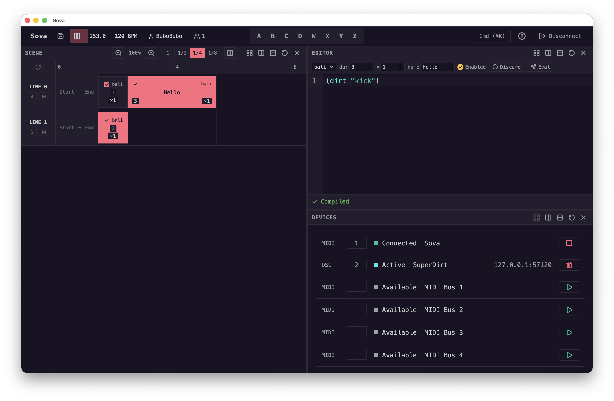

<h1 align="center">Sova (сова)</h1>

<p align="center"><em>A Polyglot Script Sequencer and a Virtual Machine for Live Coding</em></p>

<p align="center">
  
</p>

Sova is a new sequencer and musical programming environment designed in Rust, under active development. It is based on a robust virtual machine that allows to improvise music in real time through code. The virtual machine allows Sova to support multiple bespoke programming languages, each tailored to a specific way to think about music. **Sova is free and open-source software**, developed for artists, developers and researchers alike. 

* **Virtual machine**: Sova is built on a robust virtual machine that specializes in executing code precisely in realtime. The virtual machine is tightly coupled with a realtime musical scheduler based on [Ableton Link](https://developer.ableton.com/link/). Code execution is temporized, offering very strong guarantees of accuracy.


* **Polyglocy**: Sova supports using multiple programming languages concurrently in the same session, both compiled and interpreted. You can build bespoke musical programming languages for Sova or adapt your favorite live coding library to the Sova virtual machine. Each language can provide a different way to think about musical expression or a different way to describe musical sequences and musical objects.
* **Sequencer Session**: Sova code execution works following a timeline-like paradigm. It allows you to order and sequence multiple scripts both sequentialy or in parallel. It is possible to execute multiple scripts written in different languages in the same session. 
  * _Composers_ can leverage the timeline to compose pieces of music through code.
  * _Live coders_ can ignore the timeline or use it to structure a live improvisation.
* **Server/Client Architecture:** Sova is designed to support multiple clients in a same networked session. By default, Sova is ready for collaborative jamming. Anybody can start a session, anybody can join on the local network.
* **Modular**: Sova is not a monolithic piece of software. You can think of it as multiple objects forming a coherent framework or system. There is the virtual machine, the server, the various clients, etc. Take the bits you like, leave the other stuff behind.
* **I/O**: Sova is capable of emitting and receiving MIDI and OSC messages. Thanks to its modular design, it is relatively easy to add support for other protocols if the need arises.

<br>

<p align="center">
  
</p>

## Quick Start

### Prerequisites

- [Rust](https://rustup.rs/) (latest stable)
- [Node.js](https://nodejs.org/) (v18+)
- [pnpm](https://pnpm.io/)

### Build the GUI

```bash
git clone https://github.com/Bubobubobubobubo/Sova.git
cd Sova/gui
pnpm install
pnpm tauri dev
```

Pre-built releases are available on the [Releases](https://github.com/Bubobubobubobubo/Sova/releases) page.

## Project status

Sova is a young project, still to be considered in alpha stage. The virtual machine is entirely functional and works quite well. It already supports multiple programming languages, both compiled and interpreted. Clients and languages are still under development but already more than usable! Documentation and more bespoke programming languages are already on the way. You can start hacking freely, the code is stable!

Feel free to ask questions! The project is slowly growing and we are always looking for contributors or critical feedback.

## Build

See the [Quick Start](#quick-start) section above for building the GUI, or the [Contributing Guide](CONTRIBUTING.md) for detailed development setup.

## License

Sova is distributed under the [AGPL-3.0](https://www.gnu.org/licenses/agpl-3.0.en.html) license. A copy of the license is distributed with the software: [LICENSE](/LICENSE).

## Community

- [GitHub Issues](https://github.com/Bubobubobubobubo/Sova/issues) - Bug reports and feature requests.
- [GitHub Discussions](https://github.com/Bubobubobubobubo/Sova/discussions) - Questions and general discussion.
- [Contributing Guide](CONTRIBUTING.md) - How to contribute to Sova.

## Acknowledgments

The research and design work on Sova was supported by the following institutions:

- The [LS2N Laboratory](https://www.ls2n.fr) and the [University of Nantes](https://www.univ-nantes.fr).
- [Athenor CNCM](https://www.athenor.com) and its director, Camel Zekri.

Many thanks for their continuous support.
