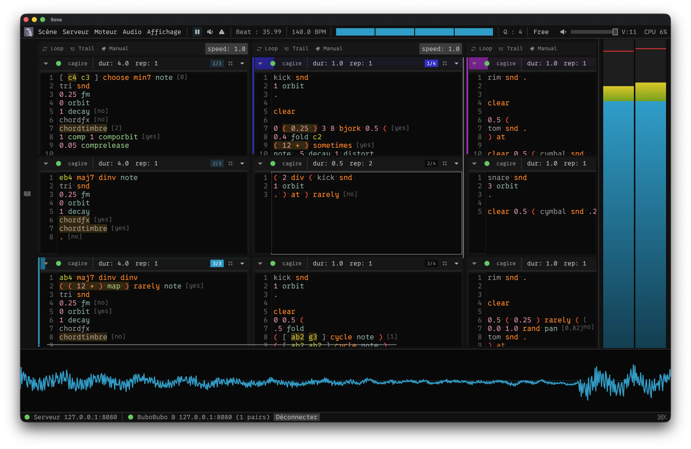

<h1 align="center">Sova (сова)</h1>

<p align="center"><em>A Polyglot Live Coding Sequencer</em></p>

<p align="center">
  
</p>

Sova is a sequencer and musical programming environment written in Rust. It is built on a virtual machine designed for real-time musical improvisation through code, supporting multiple programming languages concurrently — each offering a different way to think about musical expression. **Sova is free and open-source software** (AGPL-3.0), built for artists, students, researchers and developers.

### Features

* **Precision**: Two-thread execution model — a scheduler running ~30ms ahead of real time and a world thread at real-time priority with microsecond-accurate dispatch. Tightly coupled with [Ableton Link](https://developer.ableton.com/link/) for tempo synchronization.
* **Languages**: Ships with four languages — Bob (imperative), BaLi (Lisp-like), Boinx (pattern streams) and Cagire (stack-based). Compiled or interpreted, all sharing the same VM and I/O. Extensible via a single trait.
* **Sequencer**: A timeline of Lines (parallel tracks) and Frames (sequential steps). Per-line speed, loop boundaries, multiple execution modes. Compose structured pieces or improvise freely.
* **Multiplayer**: TCP client-server architecture with shared scene editing, real-time peer awareness and integrated chat. Start a session, anyone on the network can join.
* **Protocols**: MIDI I/O (16 device slots, notes/CC/bend/sysex/transport), OSC with timetag-accurate scheduling, SuperDirt integration. Per-device latency compensation.
* **Audio**: Built-in Doux engine — oscillators, filters, effects, sample playback with slicing and stretching. Also compatible with SuperDirt and Dough.
* **Visuals**: Built-in GLSL shader editor with real-time compilation.
* **Modular**: VM, server and clients are separate components. Use the whole system or just the parts you need.

## Quick Start

```bash
git clone https://github.com/sova-org/Sova.git
cd Sova
cargo run -p sova-desktop --release    # requires Rust (latest stable)
```

Pre-built releases are available on the [Releases](https://github.com/sova-org/Sova/releases) page.

## Build

### Prerequisites

- [Rust](https://rustup.rs/) (stable toolchain)
- CMake (`brew install cmake` on macOS, `apt install cmake` on Linux)
- Linux only: `build-essential pkg-config libasound2-dev libclang-dev libjack-dev libxcb-render0-dev libxcb-shape0-dev libxcb-xfixes0-dev libxkbcommon-dev libssl-dev libgl1-mesa-dev libx11-dev libx11-xcb-dev libxcursor-dev libxrandr-dev libxi-dev libwayland-dev`

### Workspace

| Crate | Binary | Description |
|-------|--------|-------------|
| `core` | — | Library: VM, scheduler, clock, MIDI/OSC |
| `langs` | — | Library: Bob, BaLi, Boinx, Cagire |
| `server` | `sova-server` | TCP server for multiplayer sessions |
| `desktop` | `sova-frontend` | Primary GUI client (egui) |
| `solo-tui` | `solo-tui` | Standalone terminal client |

### Commands

```bash
cargo build                                    # whole workspace
cargo build -p sova-desktop --release          # desktop client (release)
cargo build -p sova-server --release           # server (release)
cargo build -p solo-tui --release              # TUI client (release)
cargo test -p langs                            # language tests
cargo test -p core                             # core tests
cargo clippy -p core -p langs -p sova-server -p sova-desktop
```

### Running

```bash
cargo run -p sova-desktop --release            # desktop app (embeds server)
cargo run -p sova-server --release -- -p 8080  # standalone server on port 8080
cargo run -p solo-tui --release                # terminal client (embeds core)
```

### Feature flags

The server and desktop include the Doux audio engine by default. To build without audio:

```bash
cargo build -p sova-server --release --no-default-features
```

Additional flags on `server`: `soundfont` (soundfont support), `asio` (Windows ASIO driver).

## Status

Sova is in active development (alpha). The VM is fully functional, languages and clients are usable and improving. Contributions and feedback are welcome — see the [Contributing Guide](CONTRIBUTING.md).

## License

Sova is distributed under the [AGPL-3.0](https://www.gnu.org/licenses/agpl-3.0.en.html) license. A copy of the license is distributed with the software: [LICENSE](/LICENSE).

## Community

- [GitHub Issues](https://github.com/sova-org/Sova/issues) - Bug reports and feature requests.
- [GitHub Discussions](https://github.com/sova-org/Sova/discussions) - Questions and general discussion.
- [Contributing Guide](CONTRIBUTING.md) - How to contribute to Sova.

## Acknowledgments

Sova is developed by Raphaël Forment, Loïg Jezequel and Tanguy Dubois as part of a research/creation project supported by [Athénor CNCM](https://www.athenor.com) and the [LS2N laboratory](https://www.ls2n.fr) at the [University of Nantes](https://www.univ-nantes.fr).

Website: [sova.livecoding.fr](https://sova.livecoding.fr)
