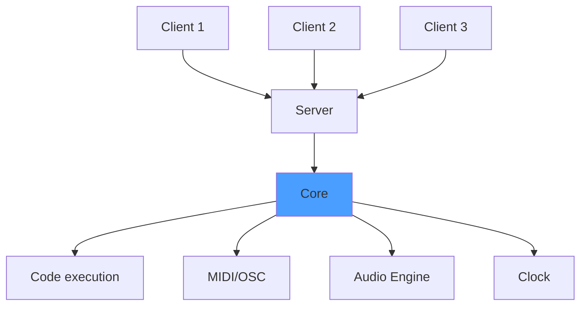

# Sova Core 

Sova Core is the innermost layer of the environment. It is a mechanism written to execute musical scripts with great temporal accuracy in a virtual environment. Scripts can be either interpreted or compiled depending on the language used.

