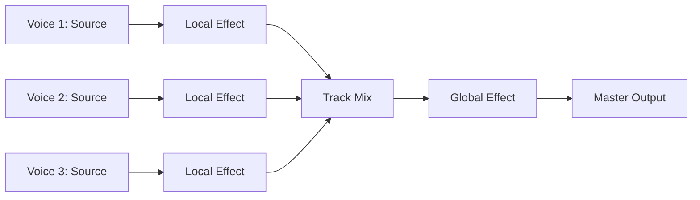

# Adding a new module

## API and conventions

There are three types of modules that can be added to the Sova audio engine:
- **Sources**: synthesis sources or sample players. They generate audio signals from scratch, after receiving a trigger. Sources are the base of each synthesis voice. In signals are also considered sources.
- **Local Effects**: audio effects applied to individual voices. The lifetime of each local effect is tied to the lifetime of the voice. Each voice is processed independently, without sharing any state with other voices.
- **Global Effects**: audio effects applied to a track output, shared by all voices on that track. Global effects are applied after the track mix, and before the master output.



## Parameter descriptors

Synthesis parameters are described using the `ParameterDescriptor` struct. Each module must provide a static array of `ParameterDescriptor` instances, one for each parameter. This array is used to generate the user interface and to validate parameter values.

```rust
#[derive(Debug, Clone)]
pub struct ParameterDescriptor {
    pub name: &'static str,
    pub aliases: &'static [&'static str],
    pub min_value: f32,
    pub max_value: f32,
    pub default_value: f32,
    pub unit: &'static str,
    pub description: &'static str,
    pub modulable: bool,
}
```
- `name`: name of given parameter.
- `aliases`: alternative names for the parameter.
- `min_value`: minimum value.
- `max_value`: maximum value.
- `default_value`: default value.  
- `unit`: the unit of the parameter (mostly _informative_).
- `description`: a short description of the parameter (mostly _informative_).
- `modulable`: whether the parameter can be modulated by an LFO or envelope.

## Sources


## Local Effects
## Global Effects
