# Sova Engine

Sova comes with a real-time polyphonic audio engine designed for live coding and performance. It prioritizes zero-allocation audio processing and sample-accurate timing. Its design is loosely similar to [Dirt](https://codeberg.org/uzu/dirt) and [SuperDirt](https://github.com/musikinformatik/SuperDirt). As a matter of fact, we aim for perfect compatibility with SuperDirt. 

The engine is designed to be modular by design. Developers can easily add / remove digital signal processing components of any type: synthesis sources (oscillators, noise generators), audio effects, etc. They can all be added to the engine rather quickly as their implementation is meant to fit in a single file written either in Rust or [Faust](https://faust.grame.fr). This file should adhere to the conventions and to the API defined by the engine, [explained on this page](/docs/engine/adding_modules.md). 

This engine is meant to be used a swiss-army-knife for audio synthesis and sampling duties. It features basic synths, samplers and audio effects. By default, it is not specialized in any type of audio synthesis or sampling. It is capable of doing _a bit of everything_ : substractive, additive, FM, wavetable, granular, etc. This engine tries to offer everything needed to be generic and open-ended. By being easy to use, and by leaning on its modular design, it is capable to offer a vast sonic palette for musicians and sound designers to explore. Moreover, each message sent to the engine can completely build up a new synthesis voice with different modules, parameters, etc.

There are multiple ways to use the Sova audio engine:
- **standalone**: useful for testing, art installations, and non live-coding centric activities!
- **as a library**: integrated in Sova, integrated in other programs.
- **through Sova**: spawn an instance attached to your session, make music!

The Sova engine can be controlled entirely through OSC messages.

## Audio Signal Flow

The signal flow of the Sova audio engine is simple and uses a fixed architecture. The simplicity of this engine allows us to make it more performant. 

```mermaid
graph LR
    S1[Sample/Synth 1] --> V1[Voice]
    S2[Sample/Synth 2] --> V2[Voice]
    S3[Sample/Synth 3] --> V3[Voice]

    V1 --> L1[Local FX]
    V2 --> L2[Local FX]
    V3 --> L3[Local FX]

    L1 --> T1[Track 1]
    L2 --> T1

    T1 --> G1[Global FX]
    G1 --> DACL[🔊 L]
    G1 --> DACR[🔊 R]

    L3 --> T2[Track 2]
    T2 --> G2[Global FX]
    G2 --> DACL
    G2 --> DACR
```

## Flags and options

The engine supports multiple flags and options that allow you to set all the important parameters before runtime. These parameters are fixed. To choose different paremeters, you need to restart the engine. You can finetune all the options using three different methods:
- Through command line arguments when starting the engine binary directly.
- Through command line arguments when starting Sova with the `--audio-engine` flag.
- Through the [GUI](docs/gui/gui.md) in the audio engine settings panel.

| Option | Default | Description |
|--------|---------|-------------|
| `-s, --sample-rate` | 44100 | Audio sample rate in Hz. Controls the quality and CPU usage of audio processing. |
| `-b, --block-size` | 512 | Audio processing block size in samples. Smaller values reduce latency but increase CPU overhead. |
| `--buffer-size` | 1024 | Audio buffer size per channel. Affects overall system latency and stability. |
| `--max-audio-buffers` | 2048 | Maximum number of audio buffers allocated for sample storage. Limits total memory usage for samples. Samples can still be allocated but some -- the oldest or unused ones -- will be unloaded in order to do so. |
| `-m, --max-voices` | 128 | Maximum number of simultaneous voices that can play concurrently. Determines polyphony capacity. |
| `--output-device` | _(auto)_ | Specific audio output device name to use. If not specified, uses system default. |
| `--osc-port` | 12345 | OSC server listening port for receiving external control messages. |
| `--osc-host` | 0.0.0.0 | OSC server host address to bind to. Use `0.0.0.0` to listen on all interfaces. |
| `--audio-files-location` | ./samples | Directory path where audio sample files are loaded from. Make sure that you have the rights to access this folder. |
| `--audio-priority` | 80 | Audio thread priority (0-99). Higher values give more CPU priority. Set to 0 to disable custom priority. Auto-mapped to platform-specific ranges. |
| `--list-devices` | - | List all available audio output devices and exit without starting the engine. |
| `-h, --help` | - | Display help information with all available options. |
