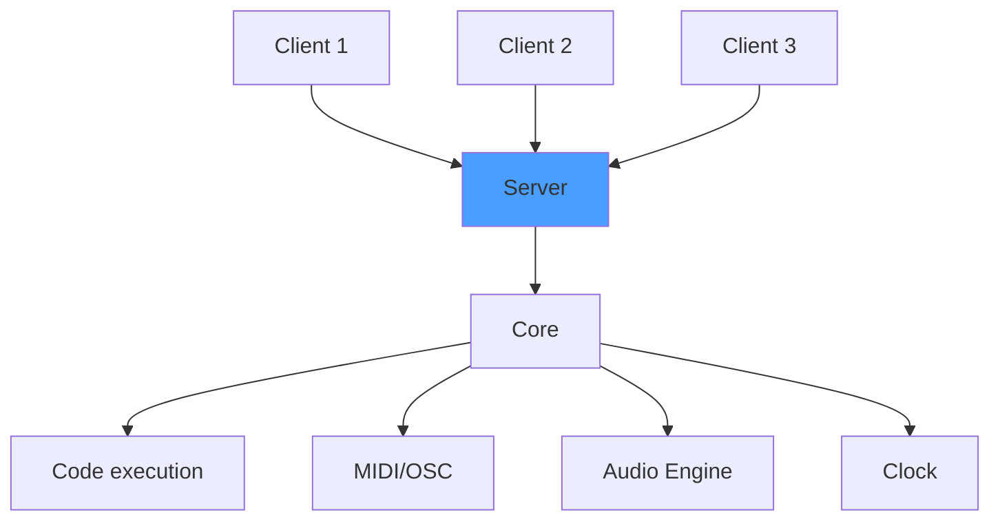

# Server

The server is the central piece of the Sova ecosystem. It sends and receives messages from the users to the core. The core itself manages MIDI, OSC, the audio engine, code interpretation/compilation, timing and execution. The server can be started either as a standalone binary or through the [GUI](docs/gui/gui). It can also optionally start the internal audio engine (see [Sova Engine](docs/engine/engine.md)).

The server settings can be configured through command line arguments when starting the server binary directly, or through the [GUI](docs/gui/gui.md) in the server settings panel. These settings cannot be changed at runtime. To choose different settings, you need to restart the server, at the risk of loosing the state of the current session.

## Flags and options
### Server Options

| Option | Default | Description |
|--------|---------|-------------|
| `-i, --ip` | 0.0.0.0 | IP address to bind the server to. |
| `-p, --port` | 8080 | Port to bind the server to. |
| `--audio-engine` | - | Enable internal audio engine (Sova). |
| `-h, --help` | - | Print help information. |
| `-V, --version` | - | Print version. |

You will also find options to configure the internal audio engine if you enable it. See [Sova Engine](docs/engine/engine.md) for more information about the specific audio engine options.